# GitHub Flavored Markdown Example

## 1. Headers

- [x] Parse headings with keywords
- [x] Parse tags
- [ ] Add property drawers


# H1 - The largest heading

## H2 - The second largest heading

### H3 - The third largest heading

#### H4 - The fourth largest heading

##### H5 - The fifth largest heading

###### H6 - The smallest heading

Hover over any heading to see a clickable anchor link (#).

## 2. Emphasis

*This text is italicized with asterisks*
_This text is italicized with underscores_

**This text is bold with asterisks**
__This text is bold with underscores__

***This text is bold and italic***
___This text is also bold and italic___

~~This text is strikethrough~~

This has ~~strikethrough~~ in the middle of a sentence.

You can combine **~~bold and strikethrough~~** or *~~italic and strikethrough~~*.

## 3. Lists

### Unordered Lists

* Item 1 with asterisk
* Item 2
    * Nested item 2.1
    * Nested item 2.2
        * Deep nested item 2.2.1

- Item 1 with dash
- Item 2
    - Nested item 2.1
    - Nested item 2.2

+ Item 1 with plus
+ Item 2
    + Nested item 2.1

### Ordered Lists

1. First item
2. Second item
3. Third item
    1. Nested item 3.1
    2. Nested item 3.2
        1. Deep nested item 3.2.1

1. Item 1
1. Item 2 (number doesn't matter)
1. Item 3

### Task Lists

- [x] Completed task
- [ ] Incomplete task
- [x] @mentions, #refs, [links](), **formatting**, and ~~tags~~ supported
- [ ] Another incomplete task
    - [x] Completed subtask
    - [ ] Incomplete subtask

## 4. Links

[Inline link](https://www.github.com)

[Inline link with title](https://www.github.com "GitHub Homepage")

[Reference link][1]

[Reference link with text][GitHub]

[Reference link with number][2]

[1]: https://www.github.com

[GitHub]: https://github.com

[2]: https://www.google.com "Google"

### Autolinks

<https://www.github.com>

<user@example.com>

Bare URLs are auto-linked: https://www.github.com

Visit https://elm-lang.org for more info.

Multiple URLs: https://elm-lang.org and https://github.com in one line.

## 5. Images


![Alt text for reference image][img1]

[img1]: https://picsum.photos/seed/picsum/200/300 "Reference image"

## 6. Code and Syntax Highlighting

### Inline Code

Use `backticks` for inline code.

### Code Blocks

```
Plain code block without syntax highlighting
function hello() {
  console.log("Hello");
}
```

```javascript
// JavaScript with syntax highlighting
function greet(name) {
  return `Hello, ${name}!`;
}
```

```python
# Python example
def factorial(n):
    if n <= 1:
        return 1
    return n * factorial(n - 1)
```

```elm
-- Elm example
type Msg
    = Increment
    | Decrement


update : Msg -> Int -> Int
update msg model =
    case msg of
        Increment ->
            model + 1

        Decrement ->
            model - 1
```

```bash
# Shell commands
echo "Hello World"
ls -la
cd /home/user
```

## 7. Tables

### Basic Table

| Name  | Age | City     |
|-------|-----|----------|
| Alice | 30  | Berlin   |
| Bob   | 25  | Istanbul |
| Carol | 35  | Tokyo    |

### Column Alignment

| Left aligned | Center aligned | Right aligned | Default |
|:-------------|:--------------:|--------------:|---------|
| Left         |     Center     |         Right | Default |
| text         |      text      |           123 | text    |
| more         |      more      |           456 | more    |

### Inline Formatting in Cells

| Feature       | Syntax        | Rendered                    |
|---------------|---------------|-----------------------------|
| Bold          | `**bold**`    | **bold**                    |
| Italic        | `*italic*`    | *italic*                    |
| Code          | `` `code` ``  | `code`                      |
| Link          | `[text](url)` | [Elm](https://elm-lang.org) |
| Bold + Italic | `***both***`  | ***both***                  |

### Minimal Table (no leading/trailing pipes)

 Name  | Score 
-------|-------
 Alice | 95    
 Bob   | 87    

### Single Column Table

| Item     |
|----------|
| Apples   |
| Bananas  |
| Cherries |

### Wide Table

| Language   | Paradigm   | Typing  | Compiled | Year | Creator          |
|------------|------------|---------|----------|------|------------------|
| Elm        | Functional | Static  | Yes      | 2012 | Evan Czaplicki   |
| Haskell    | Functional | Static  | Yes      | 1990 | Committee        |
| JavaScript | Multi      | Dynamic | No       | 1995 | Brendan Eich     |
| Rust       | Multi      | Static  | Yes      | 2010 | Graydon Hoare    |
| Python     | Multi      | Dynamic | No       | 1991 | Guido van Rossum |

## 8. Blockquotes

> This is a blockquote.
> It can span multiple lines.

> Blockquotes can be nested
>> Like this
>>> And even deeper

> Blockquotes can contain other Markdown elements:
>
> - Lists
> - **Bold text**
> - `Code`

## 9. Horizontal Rules

Three or more hyphens:

---

Three or more asterisks:

***

Three or more underscores:

___

## 10. Line Breaks

To create a line break, end a line with two or more spaces.
This is on a new line.

Or use a backslash\
This also creates a line break.

## 11. Escaping Characters

Use backslashes to escape special characters:

\*Not italic\*
\**Not bold\**
\[Not a link\](not a url)
\`Not code\`

## 12. Footnotes

Here is some text with a footnote[^1] and another[^note].

Footnotes are rendered at the bottom of the document with back-links[^back].

[^1]: This is the first footnote definition.
[^note]: This is a named footnote.
[^back]: Back-links let you jump back to the reference.

## 13. Autolinked Emails

Bare email addresses are auto-linked:

Contact us at user@example.com for general inquiries.

Send bug reports to support@grasp-app.dev or feedback@grasp-app.dev.

## 14. Highlight / Mark

Use double equals to ==highlight text== in a sentence.

You can have ==multiple highlights== in the ==same paragraph==.

Highlighting works with **==bold highlighted==** text too.

## 15. GitHub Alerts

> [!NOTE]
> Useful information that users should know, even when skimming.

> [!TIP]
> Helpful advice for doing things better or more easily.

> [!IMPORTANT]
> Key information users need to know to achieve their goal.

> [!WARNING]
> Urgent info that needs immediate user attention to avoid problems.

> [!CAUTION]
> Advises about risks or negative outcomes of certain actions.

Regular blockquotes still work normally:

> This is a regular blockquote, not an alert.

## 16. Emoji Shortcodes

Faces: :smile: :wink: :joy: :sunglasses: :thinking:

Hands: :thumbsup: :thumbsdown: :wave: :clap: :pray:

Symbols: :heart: :fire: :star: :sparkles: :100:

Objects: :rocket: :tada: :bulb: :memo: :wrench:

Nature: :sun: :moon: :cloud: :snowflake: :coffee:

Unknown shortcodes render as-is: :not_a_real_emoji:

## 17. Math (KaTeX)

### Inline Math

Euler's identity $e^{i\pi} + 1 = 0$ is often called the most beautiful equation in mathematics.

The quadratic formula $x = \frac{-b \pm \sqrt{b^2 - 4ac}}{2a}$ solves any quadratic equation.

A circle has area $A = \pi r^2$ and circumference $C = 2\pi r$.

### Display Math

$$E = mc^2$$

$$\int_0^\infty e^{-x^2} dx = \frac{\sqrt{\pi}}{2}$$

$$\sum_{n=1}^{\infty} \frac{1}{n^2} = \frac{\pi^2}{6}$$

### Matrices and Systems

$$\begin{pmatrix} a & b \\ c & d \end{pmatrix} \begin{pmatrix} x \\ y \end{pmatrix} = \begin{pmatrix} ax + by \\ cx + dy \end{pmatrix}$$

### Calculus

$$\frac{d}{dx} \left[ \int_0^x f(t) \, dt \right] = f(x)$$

$$\nabla \times \mathbf{E} = -\frac{\partial \mathbf{B}}{\partial t}$$

### Probability and Statistics

$$P(A \mid B) = \frac{P(B \mid A) \, P(A)}{P(B)}$$

$$\sigma = \sqrt{\frac{1}{N} \sum_{i=1}^{N} (x_i - \mu)^2}$$

### Greek Letters and Symbols

Inline Greek: $\alpha, \beta, \gamma, \delta, \epsilon, \zeta, \eta, \theta$

$$\forall x \in \mathbb{R}, \quad \exists n \in \mathbb{N} : n > x$$

### Currency (should NOT render as math)

This item costs $5 and that one costs $10. No math here.

# Testing Nested Lists for Blog Publishing

## Unordered Lists (Multiple Levels)

- First level item one
    - Second level item one
        - Third level item one
        - Third level item two
            - Fourth level item one
            - Fourth level item two
    - Second level item two
    - Second level item three
- First level item two
- First level item three with longer text that wraps to multiple lines to test line spacing and readability on mobile
  devices
    - Second level with long text: Lorem ipsum dolor sit amet, consectetur adipiscing elit. Sed do eiusmod tempor
      incididunt ut labore et dolore magna aliqua.
        - Third level also with extensive content to test deep nesting visual hierarchy

## Ordered Lists (Multiple Levels)

1. First ordered item
    1. Nested ordered item one
    2. Nested ordered item two
        1. Deeply nested item
        2. Another deeply nested item
    2. Back to second level
2. Second ordered item
3. Third ordered item

## Mixed Lists

1. First ordered item
    - Unordered sub-item one
    - Unordered sub-item two
        1. Back to ordered
        2. Another ordered item
    - Unordered sub-item three
2. Second ordered item
    - Another unordered item
        - Deeper unordered
            1. Ordered in deep nesting

## Task Lists

- [ ] Unchecked task
    - [ ] Nested unchecked task
    - [x] Nested checked task
        - [ ] Deeply nested unchecked
        - [x] Deeply nested checked
- [x] Checked task
- [ ] Another unchecked task

## Lists with Paragraphs

- First item with a paragraph

  This is a paragraph within the list item. It should maintain proper indentation and spacing.

  Another paragraph in the same list item.

- Second item

    - Nested item with paragraph

      This paragraph is in a nested list item.

    - Another nested item

- Third item

## Real Content Example

### Research Paper Structure

1. **Introduction**
    - Background and motivation
    - Problem statement
    - Research questions:
        1. How does quantum entanglement affect computing?
        2. What are the practical limitations?
        3. Can we scale to industrial applications?
    - Thesis statement

2. **Literature Review**
    - Classical approaches
        - Von Neumann architecture
        - Parallel computing paradigms
    - Quantum computing foundations
        1. Superposition principle
        2. Entanglement phenomena
        3. Quantum gates and circuits
    - Recent advances (2020-2024)

3. **Methodology**
    - Experimental setup
        - Hardware specifications
            - IBM Quantum System One
            - Google Sycamore processor
        - Software framework
    - Data collection procedures
    - Analysis techniques

## Deeply Nested Scientific Content

### Mathematical Concepts Hierarchy

- **Calculus**
    - Differential Calculus
        - Limits and Continuity
            - Epsilon-delta definition
            - One-sided limits
            - Continuity at a point
        - Derivatives
            - Definition and notation
            - Rules of differentiation
                - Product rule
                - Chain rule
                - Quotient rule
            - Applications
                - Optimization problems
                - Related rates
                - Linear approximation
    - Integral Calculus
        - Definite integrals
            - Riemann sums
            - Fundamental theorem
        - Indefinite integrals
            - Integration techniques
                - Substitution
                - Integration by parts
                - Partial fractions

## Mermaid Diagrams

### Flowchart

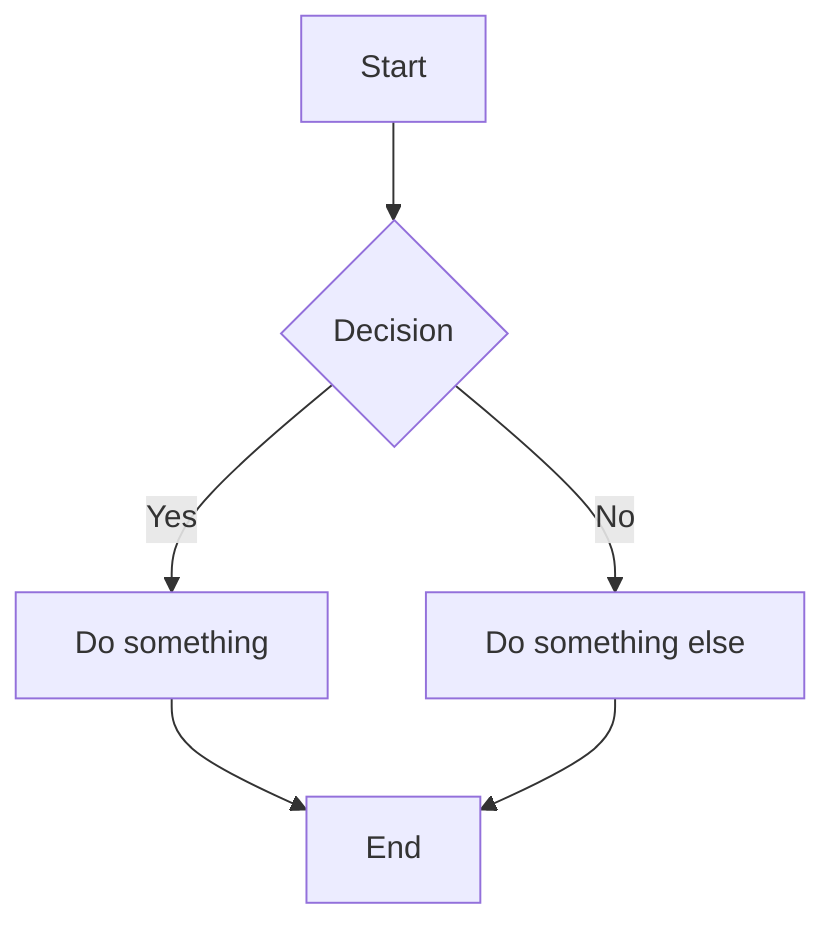

### Flowchart (LR)

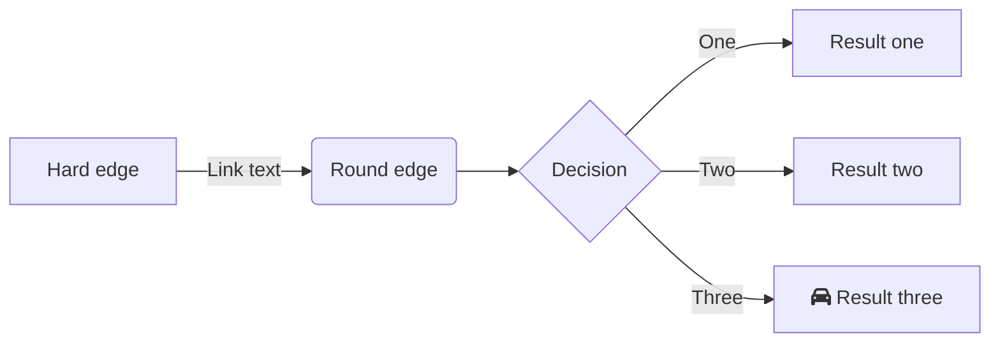

### Sequence Diagram

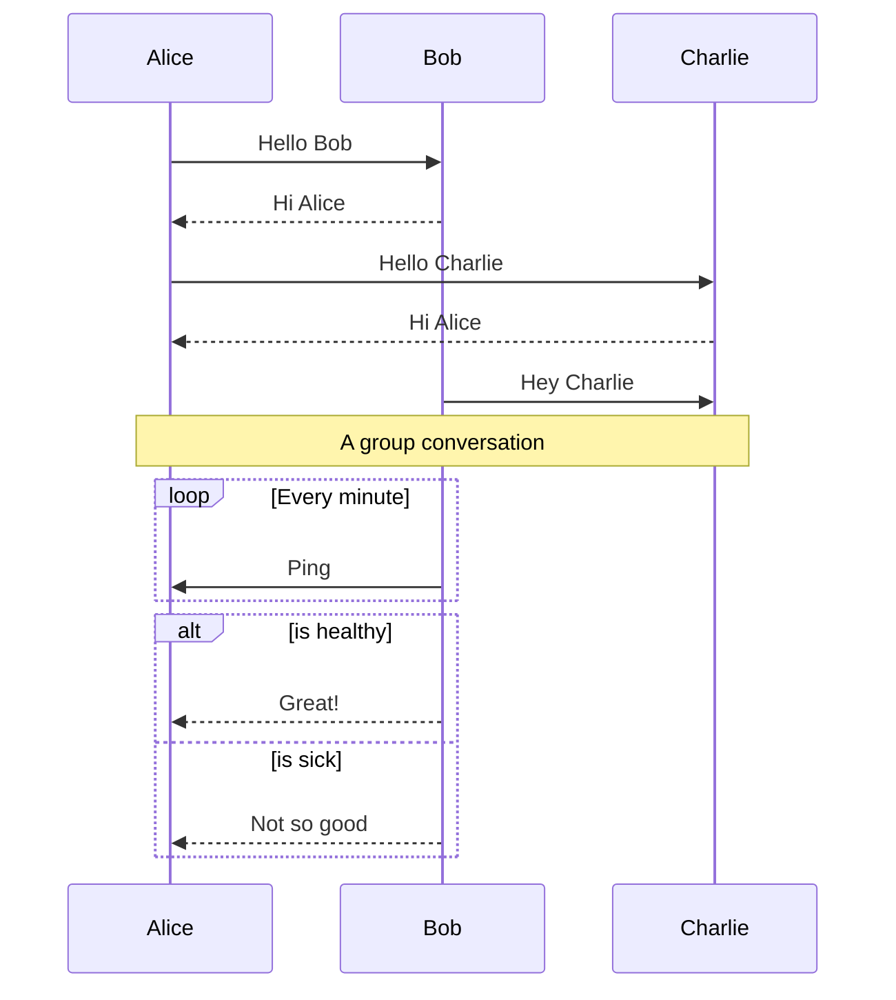

### Class Diagram

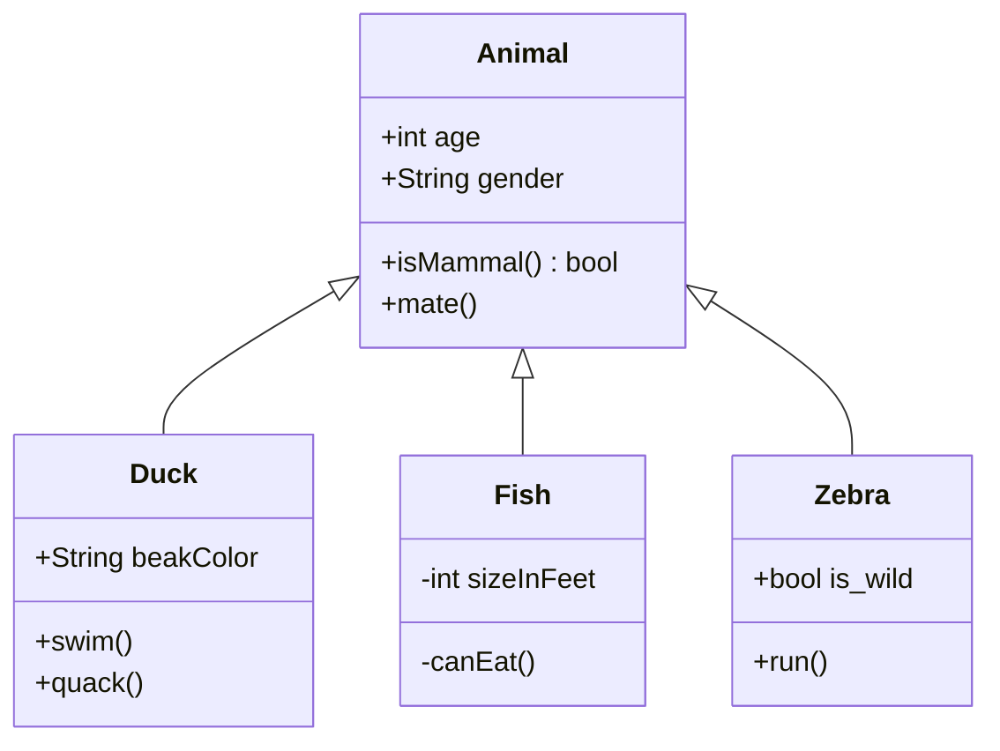

### State Diagram

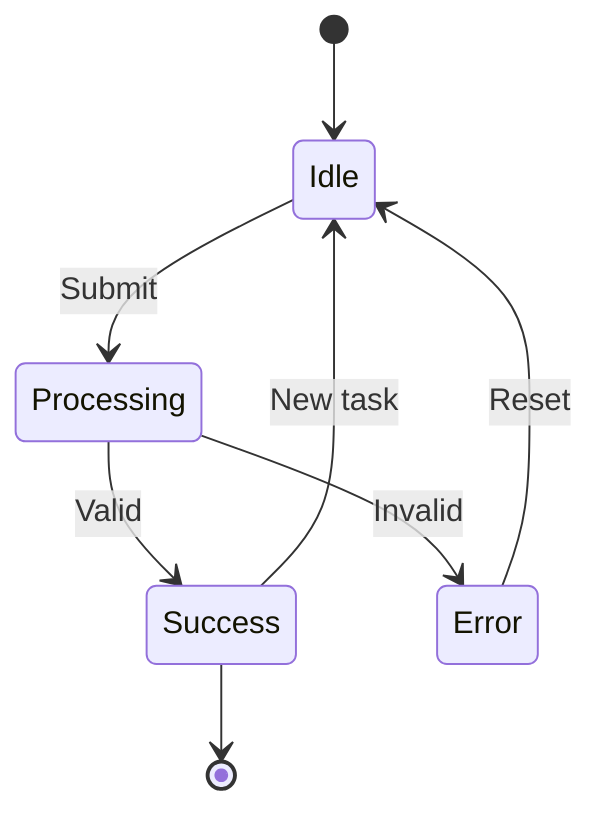

### Entity Relationship Diagram

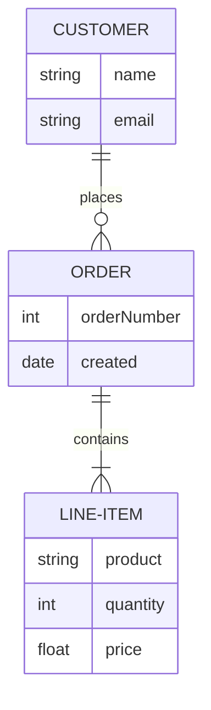

### Gantt Chart

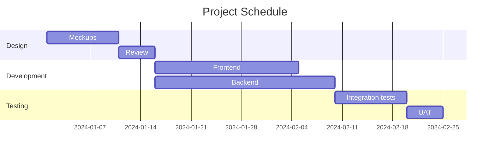

### Pie Chart

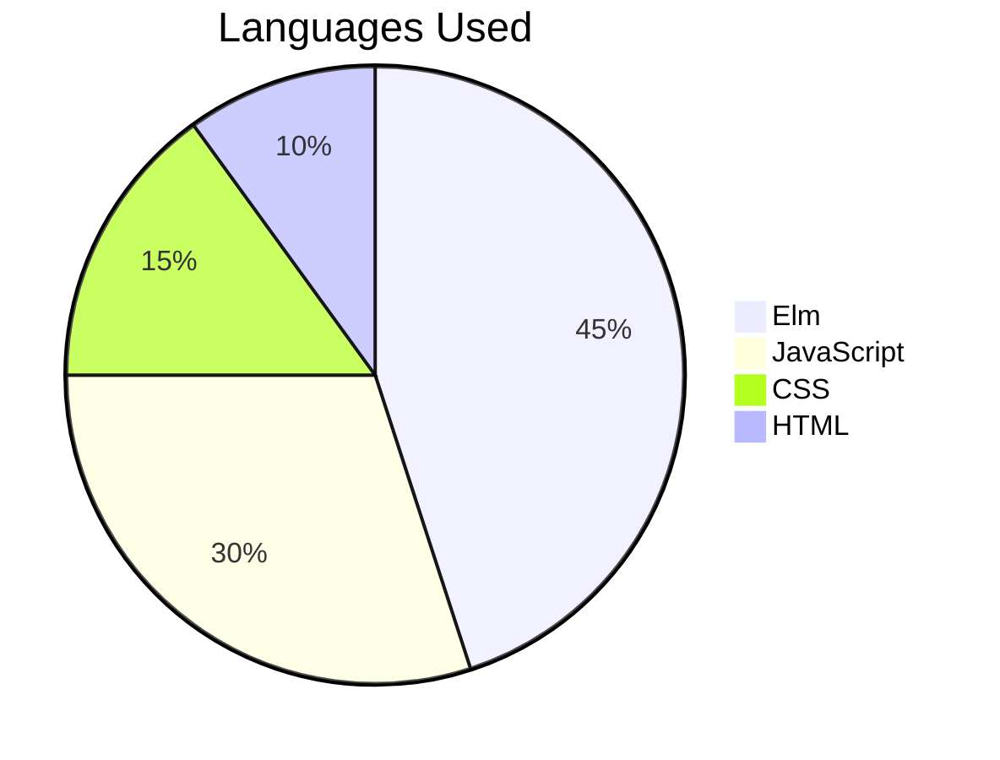

### Git Graph

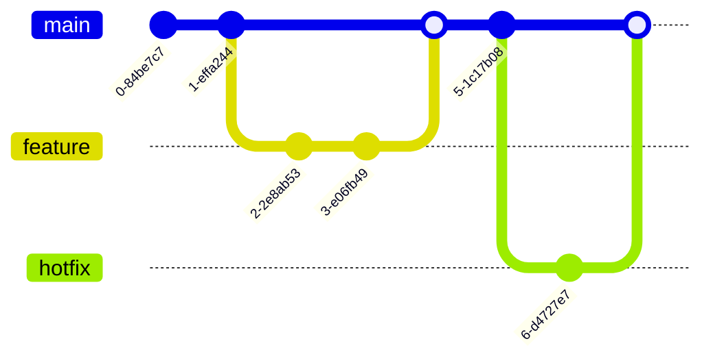

### Mindmap

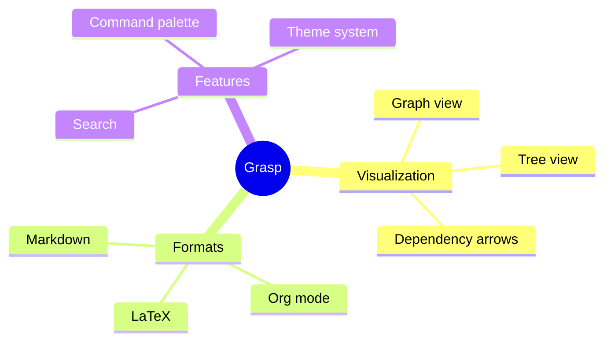

### Timeline

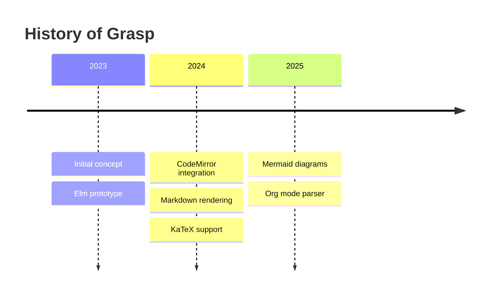

### Quadrant Chart

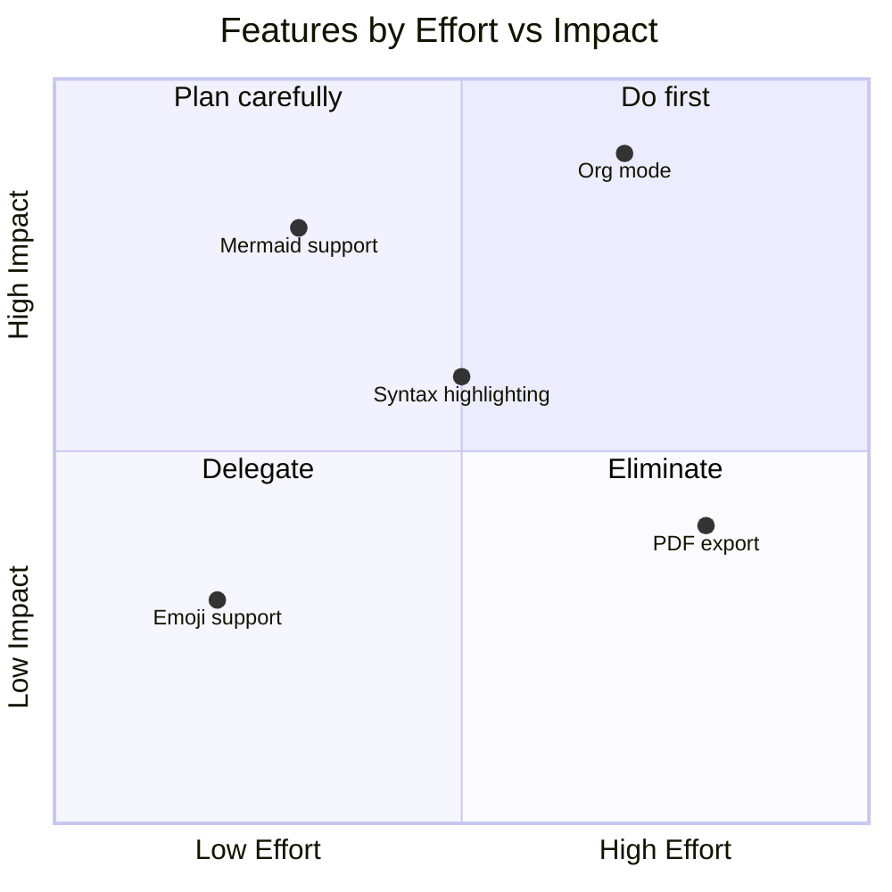

### Flowchart with Subgraphs

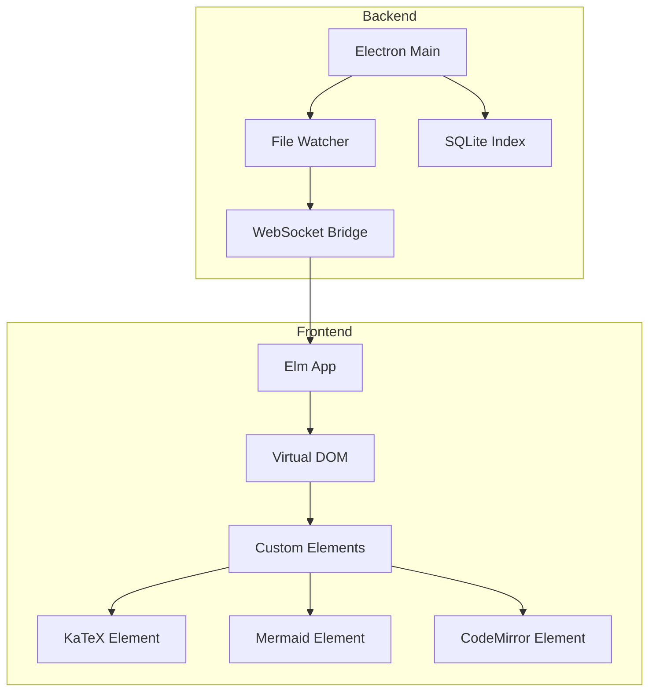